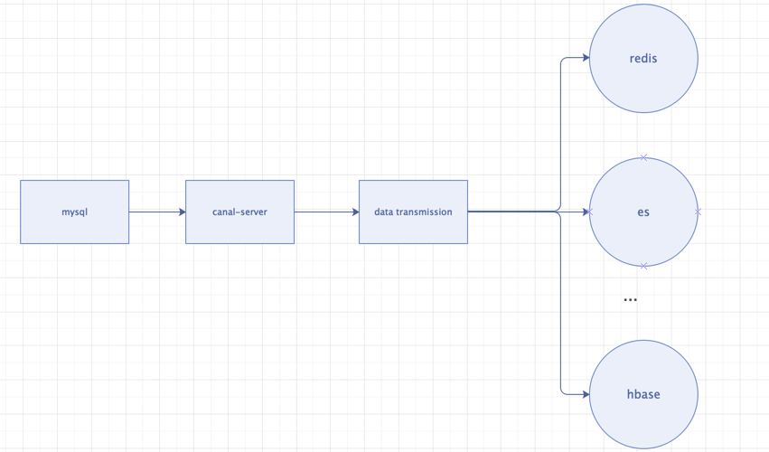

# data-transmission
1. 基于阿里开源中间件canal，实现简单的"数据传输"【阿里云有DTS】，不想买阿里DTS服务的朋友们可以参考这个项目。
2. 此项目作为canal-client使用，需要自己部署canal-server。canal-server可以查阅canal的官方文档，再此不详述。
3. 支持分库分表，根据订阅的binlog日志，针对每个库的数据传输任务可以自定义如何格式化库名和表名。
4. 目前已实现的方案是从mysql同步数据到ES中，支持扩展；可根据需求自己实现数据传输到不同目标源。

## 目录结构
1. canal 与 canal-server交互逻辑，拉取数据。
2. business 业务相关。从 canal-server拉取后的数据会经过清洗生成对应的实体类，策略用来自定义入库逻辑。
3. factory 针对每种目标源（ES等）应有不同的策略工厂。
4. strategy 针对每张表的insert、delete、update需要不同的处理策略。

## 食用方式
1. 如果目标源也是ES，只需参考business目录下，参照`SmsNewDataTransmitTask`、`SmsMsgDataTransmitToElasticStrategy`编写自定义的task、strategy即可。
2. 如果要扩展目标源（如：REDIS、HBASE等）的情况下，完成上述1的后，参照`DataTransmitToElasticStrategyFactory`自定义策略工厂。

有疑问可联系：jarvis.hux@gmail.com

